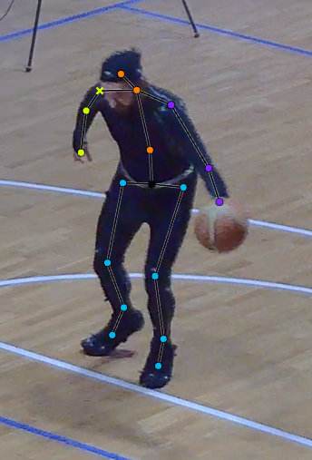
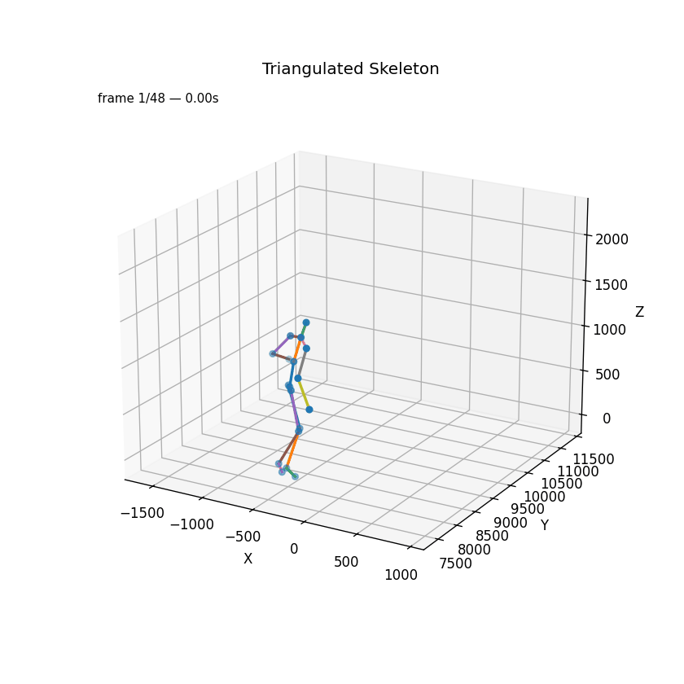
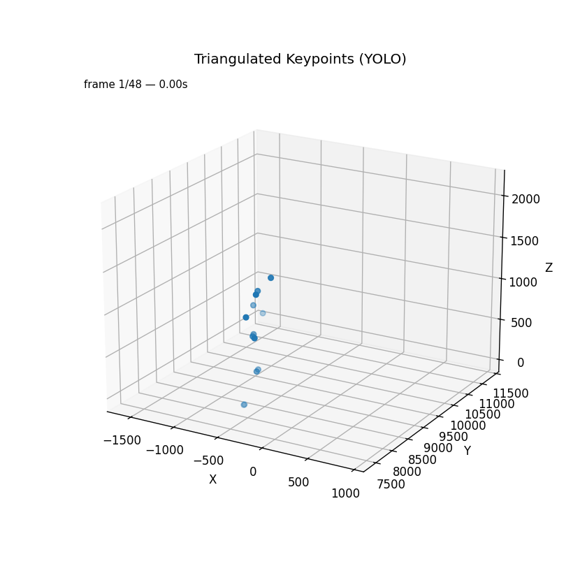

# Multiview Motion Capture Evaluation Project

## 🏀 Project Goal

Estimate the player's 3D poses using a **multiview camera setup** recorded at *Sanbàpolis*, and evaluate the accuracy of the triangulated 3D skeletons by comparing them with **motion capture (MoCap)** data.

---
## ⚙️ Requirements 
Python version:
```bash
python 3.12 or later
```
Run this command to install the required libraries:
```bash
pip install -r requirements.txt
```
---

## 📋 Project Steps

### 1. Annotate Player’s Poses
- Each action is captured by **four synchronized camera views** (`cam_2`, `cam_5`, `cam_8`, `cam_13`).
- **Only the person wearing the black MoCap suit** was annotated.
- Annotations were created using **Roboflow** and exported in **COCO JSON format**.



---

### 2. 3D Player Reconstruction via Triangulation

Using the 2D keypoints annotated from the multiview cameras, we reconstruct the player’s 3D pose via **triangulation**.

#### Pipeline
1. **Rectify input videos and images**  
   The rectification removes lens distortion and aligns all cameras to a common epipolar geometry.  
   *(Important: the same transformation must also be applied to the ground-truth annotations.)*

2. **Triangulation**  
   3D points are computed from corresponding 2D detections across views using the **Direct Linear Transform (DLT)** method.

3. **Visualization**  
   Display the reconstructed 3D skeleton for a given frame.

4. **Reprojection & Evaluation**  
   Reproject the triangulated 3D skeleton back onto each camera view and compare it with the original 2D annotations using standard metrics:
   - **Mean Per Joint Position Error (MPJPE)**
   - **Mean Squared Error (MSE)**

#### Executed scripts
```bash
python 02_download_roboflow.py
python 02_rectified_videos.py
python 02_rectified_images.py
python 02_rectified_annotations.py
python 02_debug_draw_keypoint_over_frame_check.py --image train/out2_frame_0019_png.rf.aa99af7677dc057dc1f577a91cafef39.jpg --annotations train/_annotations.coco.json --image_id 48 --output temp/02_temp/02_debug_draw_normal.png
python 02_debug_draw_keypoint_over_frame_check.py --image images_rectified/out2_frame_0019_png.rf.aa99af7677dc057dc1f577a91cafef39.jpg --annotations temp/02_temp/02_annotations.coco.rectified.json --image_id 48 --output temp/02_temp/02_debug_draw_rectified.png
python 02_triangulation.py --input temp/02_temp/02_annotations.coco.rectified.json --output temp/02_temp/02_triangulated_3d_skeleton.json
python 02_plot_3d_skeleton.py 1
python 02_generate_reprojected_annotations.py
python 02_compute_reprojection_error.py
python 02_debug_plot_2D_compare_keypoints.py 10
python 02_animate_triangulation.py  --input temp/02_temp/02_triangulated_3d_skeleton.json --out temp/02_temp/02_triangulated_skeleton.gif --fps 12
```

### 3. Alignment with Motion Capture Data

The MoCap system and the multiview RGB setup are **not synchronized**, so alignment must be performed manually or algorithmically.

#### Procedure
1. Identify reference poses (e.g., player raising arms before a shot) in both datasets.
2. Match corresponding poses to align the MoCap and triangulation timelines.
3. Subsample and rename frames to obtain consistent frame rates and naming schemes.
4. Align and compare the 3D skeletons using the **Kabsch–Umeyama algorithm** for rigid alignment.

#### Executed scripts
```bash
python 03_cut_frames.py      # cut the shot segment of interest
python 03_adapt_skeleton.py  # remove extra bones
python 03_animate_mocap.py   # generate an MP4 video of the MoCap data (100 fps, 393 frames)
python 03_subsample_mocap.py # downsample from 100 fps to 24 fps
python 03_rename_frame.py                   # e.g., frame_980 → frame_1
python 03_reorder_triangulation_joints.py   # reorder the triangulation joints as in the MoCap data
python 03_step3compare.py
python 03_animate_mocap.py --input temp/03_temp/03_final_triangulation.json --out temp/03_temp/03_final_triangulation.gif --fps 12 --rotate -90 --name "Triangulated Skeleton"
python 03_animate_mocap.py --input temp/03_temp/03_final_mocap.json --out temp/03_temp/03_final_mocap.gif --fps 12
```

| MoCap Frame | Triangulation Frame | Notes              |
|-------------|---------------------|--------------------|
| 1322        | 42                  | baseline alignment |
| 1372        | 48                  | 8.3 fps × 6 frames |
| 980         | 1                   | 8.3 fps × 41 frames|

### Evaluation Metrics
- Mean Per Joint Position Error (MPJPE)
- Mean Squared Error (MSE)
- Median Joint Error

## 🧩 Skeleton Mapping

### Motion Capture Keypoints
```bash
'Hips', 'Spine', 'Spine1', 'Spine2', 'Neck', 'Head',
'LeftShoulder', 'LeftArm', 'LeftForeArm', 'LeftForeArmRoll', 'LeftHand',
'RightShoulder', 'RightArm', 'RightForeArm', 'RightForeArmRoll', 'RightHand',
'LeftUpLeg', 'LeftLeg', 'LeftFoot', 'LeftToeBase',
'RightUpLeg', 'RightLeg', 'RightFoot', 'RightToeBase'
```

Removed six extra joints:  
`Spine`, `Spine2`, `LeftShoulder`, `LeftForeArmRoll`, `RightShoulder`, `RightForeArmRoll`.

---

### Triangulation Keypoints
```bash
"Hips", "RHip", "RKnee", "RAnkle", "RFoot",
"LHip", "LKnee", "LAnkle", "LFoot",
"Spine", "Neck", "Head",
"RShoulder", "RElbow", "RHand",
"LShoulder", "LElbow", "LHand"
```

---

### Unified Skeleton Order (used for comparison)
```bash
'Hips', 'Spine', 'Neck', 'Head',
'LShoulder', 'LElbow', 'LHand',
'RShoulder', 'RElbow', 'RHand',
'LHip', 'LKnee', 'LAnkle', 'LFoot',
'RHip', 'RKnee', 'RAnkle', 'RFoot'
```

## 4. Human Pose Estimation

For the human pose estimation step, we used the pre-trained **YOLO v11 pose model**.
```bash
python 04_divide_images.py
python 04_yolo_pose.py --images images_rectified/cam_2 --output temp/04_temp/labels2.json --weights yolo11l-pose.pt --imgsz 3840 --conf 0.20 --device cuda:0
python 04_yolo_pose.py --images images_rectified/cam_5 --output temp/04_temp/labels5.json --weights yolo11l-pose.pt --imgsz 3840 --conf 0.20 --device cuda:0
python 04_yolo_pose.py --images images_rectified/cam_8 --output temp/04_temp/labels8.json --weights yolo11l-pose.pt --imgsz 3840 --conf 0.20 --device cuda:0
python 04_yolo_pose.py --images images_rectified/cam_13 --output temp/04_temp/labels13.json --weights yolo11l-pose.pt --imgsz 3840 --conf 0.20 --device cuda:0

python 04_test_labels.py --images images_rectified/cam_2 --json temp/04_temp/labels2.json --outdir temp/04_temp/cam2
python 04_test_labels.py --images images_rectified/cam_5 --json temp/04_temp/labels5.json --outdir temp/04_temp/cam5
python 04_test_labels.py --images images_rectified/cam_8 --json temp/04_temp/labels8.json --outdir temp/04_temp/cam8
python 04_test_labels.py --images images_rectified/cam_13 --json temp/04_temp/labels13.json --outdir temp/04_temp/cam13

# Visual inspection of the basketball player's ID across the 4 cameras

python 04_remove_multiple_people.py --input temp/04_temp/labels2.json --output temp/04_temp/labels2_filtered.json --keep_id 1
python 04_remove_multiple_people.py --input temp/04_temp/labels5.json --output temp/04_temp/labels5_filtered.json --keep_id 2
python 04_remove_multiple_people.py --input temp/04_temp/labels8.json --output temp/04_temp/labels8_filtered.json --keep_id 1
python 04_remove_multiple_people.py --input temp/04_temp/labels13.json --output temp/04_temp/labels13_filtered.json --keep_id 1

# Remove incompatible joints
python 04_adapt_keypoint.py 2
python 04_adapt_keypoint.py 5
python 04_adapt_keypoint.py 8
python 04_adapt_keypoint.py 13

python 04_merge_pose_jsons_like_rectified.py temp/04_temp/labels2_filtered_adapted.json temp/04_temp/labels5_filtered_adapted.json temp/04_temp/labels8_filtered_adapted.json temp/04_temp/labels13_filtered_adapted.json --out temp/04_temp/annotations_yolo.json

python 02_triangulation.py --input temp/04_temp/annotations_yolo.json --output temp/04_temp/04_triangulated_yolo.json

python 04_animate_yolo.py --input temp/04_temp/04_triangulated_yolo.json --out temp/04_temp/04_yolo.gif --fps 12
python 04_adapt_mocap.py   # removes extra joints from MoCap
python 03_step3compare.py --mocap temp/04_temp/04_adapted_final_mocap.json --triang temp/04_temp/04_triangulated_yolo.json --align similarity
```

## Results

### Triangulation vs MoCap (final accuracy):

MPJPE 69.7 mm (mean), 69.8 mm (median)<br>
MSE 5767.8 mm², RMSE 75.3 mm<br>
Coherent 3D reconstruction with ~7–8 cm average joint error.

<p align="center">
  
  
</p>

### YOLO Pose Triangulation vs MoCap:

MPJPE 68.9 mm (mean), 66.1 mm (median)<br>
MSE 5947.1 mm², RMSE 75.3 mm<br>
Coherent 3D reconstruction with ~7–8 cm average joint error.

<p align="center">
  
  
</p>


## 👥 Authors

Nicola Cappellaro - nicola.cappellaro@studenti.unitn.it  
Riccardo Zannoni  - riccardo.zannoni@studenti.unitn.it
