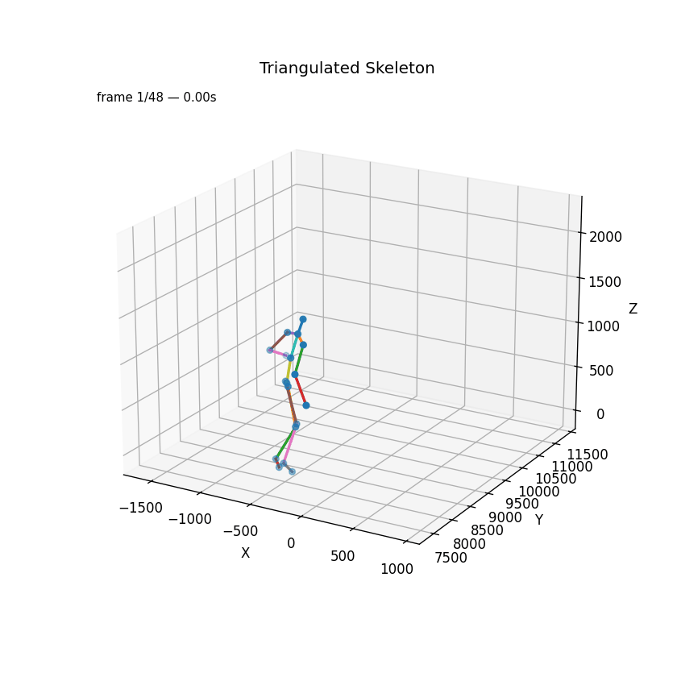
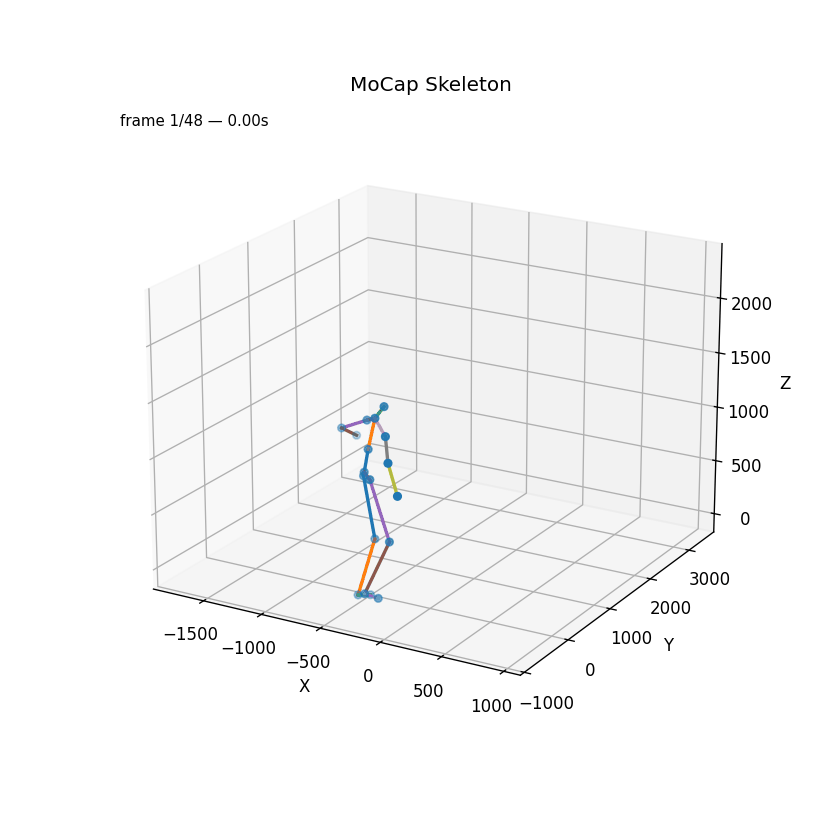

# Multiview Motion Capture Evaluation Project

## 🏀 Project Goal

Estimate the player's 3D poses using a **multiview camera setup** recorded at *Sanbàpolis*, and evaluate the accuracy of the triangulated 3D skeletons by comparing them with **motion capture (MoCap)** data.

---

## 📋 Project Steps

### 1. Annotate Player’s Poses
- Each action is captured by **4 synchronized camera views** (`cam_2`, `cam_5`, `cam_8`, `cam_13`).
- One action per group of 2 people.
- Around **100 frames per person**.
- Annotate **only the person wearing the black MoCap suit**.
- Annotations were created using **Roboflow** and exported in **COCO JSON format**.


---

### 2. 3D Player Reconstruction via Triangulation

Using the 2D keypoints annotated from the multiview cameras, we reconstruct the player’s 3D pose via **triangulation**.

#### Pipeline
1. **Rectify input videos and images**  
   The rectification removes lens distortion and aligns all cameras to a common epipolar geometry.  
   *(Important: the same transformation must also be applied to the ground-truth annotations).*

2. **Triangulation**  
   3D points are computed from corresponding 2D detections across views using the **Direct Linear Transform (DLT)** method.

3. **Visualization**  
   Display the reconstructed 3D skeleton for a given frame.

4. **Reprojection & Evaluation**  
   Reproject the triangulated 3D skeleton back to each camera view and compare it with the original 2D annotations using standard metrics:
   - **Mean Per Joint Position Error (MPJPE)**
   - **Mean Squared Error (MSE)**

#### Executed scripts
```bash
python 01_rectified_videos.py
python 01_rectified_images.py
python 01_rectified_annotations.py
python 01_draw_keypoint_over_frame_check.py

python 02_triangulation.py --input _annotations.coco.rectified.json --output triangulated_3d_skeleton.json # TODO(testare se va) 
python 02_plot_3d_skeleton.py [frame_number]
python 02_generate_reprojected_annotations.py
python 02_compute_reprojection_error.py
python 02_animate_triangulation.py  --input triangulated_3d_skeleton.json --out 02_triangulated_skeleton.gif --fps 12
```
### 3. Alignment with Motion Capture Data

The MoCap system and the multiview RGB setup are **not synchronized**, so alignment must be performed manually or algorithmically.

#### Procedure
1. Identify reference poses (e.g., player raising arms before a shot) in both datasets.
2. Match corresponding poses to align the MoCap and triangulation timelines.
3. Subsample and rename frames to achieve consistent frame rates and naming schemes.
4. Align and compare the 3D skeletons using the Kabsch–Umeyama algorithm for rigid alignment.

Executed scripts
```bash
python 03_animate_mocap.py                  # generate a video of the mocap data
python 03_cut_frames.py --input keypoints_mocap.json --output selected_keypoints.json --start 980 --end 1372                     # cut the shot part of our interest
python 03_adapt_skeleton.py selected_keypoints.json selected_keypoints_adapted_joints.json                 # remove extra bones
python 03_subsample_mocap.py -i selected_keypoints_adapted_joints.json -o selected_keypoints_adapted_joints_48frames.json --start 980 --step 8.3                # from 100 fps to 24 fps
python 03_rename_frame.py                   # e.g., frame_980 → frame_1
python 03_reorder_triangulation_joints.py   # order the triangulation joint as the mocap
python 03_step3compare.py --mocap final_mocap.json --triang final_triangulation.json --align similarity
```

| MoCap Frame | Triangulation Frame | Notes              |
|-------------|---------------------|--------------------|
| 1322        | 42                  | baseline alignment |
| 1372        | 48                  | 8.3 fps x 6 frames |
| 980         | 1                   | 8.3 fps x 41 frames|

### Evaluation Metrics
- Mean Per Joint Position Error (MPJPE)
- Mean Squared Error (MSE)
- Median Joint Error

## 🧩 Skeleton Mapping

### Motion Capture Keypoints
```bash
'Hips', 'Spine', 'Spine1', 'Spine2', 'Neck', 'Head',
'LeftShoulder', 'LeftArm', 'LeftForeArm', 'LeftForeArmRoll', 'LeftHand',
'RightShoulder', 'RightArm', 'RightForeArm', 'RightForeArmRoll', 'RightHand',
'LeftUpLeg', 'LeftLeg', 'LeftFoot', 'LeftToeBase',
'RightUpLeg', 'RightLeg', 'RightFoot', 'RightToeBase'
```

Removed 6 extra joints:  
`Spine`, `Spine2`, `LeftShoulder`, `LeftForeArmRoll`, `RightShoulder`, `RightForeArmRoll`.

---

### Triangulation Keypoints
```bash
"Hips", "RHip", "RKnee", "RAnkle", "RFoot",
"LHip", "LKnee", "LAnkle", "LFoot",
"Spine", "Neck", "Head",
"RShoulder", "RElbow", "RHand",
"LShoulder", "LElbow", "LHand"
```

---

### Unified Skeleton Order (used for comparison)
```bash
'Hips', 'Spine', 'Neck', 'Head',
'LShoulder', 'LElbow', 'LHand',
'RShoulder', 'RElbow', 'RHand',
'LHip', 'LKnee', 'LAnkle', 'LFoot',
'RHip', 'RKnee', 'RAnkle', 'RFoot'
```

## 4. Human Pose Estimation

For the human pose estimation step, we used the pre-trained YOLO v11 pose model.
```bash
python 04_yolo_pose.py --images images_rectified/cam_2 --output 04_temp/labels2.json --weights yolo11l-pose.pt --imgsz 3840 --conf 0.20
python 04_yolo_pose.py --images images_rectified/cam_5 --output 04_temp/labels5.json --weights yolo11l-pose.pt --imgsz 3840 --conf 0.20
python 04_yolo_pose.py --images images_rectified/cam_8 --output 04_temp/labels8.json --weights yolo11l-pose.pt --imgsz 3840 --conf 0.20
python 04_yolo_pose.py --images images_rectified/cam_13 --output 04_temp/labels13.json --weights yolo11l-pose.pt --imgsz 3840 --conf 0.20

(debug) python 04_test_labels.py --images images_rectified/cam_2 --json 04_temp/labels2.json --outdir 04_temp/cam2
(debug) python 04_test_labels.py --images images_rectified/cam_5 --json 04_temp/labels5.json --outdir 04_temp/cam5
(debug) python 04_test_labels.py --images images_rectified/cam_8 --json 04_temp/labels8.json --outdir 04_temp/cam8
(debug) python 04_test_labels.py --images images_rectified/cam_13 --json 04_temp/labels13.json --outdir 04_temp/cam13

# controllo visivo dell'id del giocatore di basket per le 4 camere

python 04_remove_multiple_people.py --input 04_temp/labels2.json --output 04_temp/labels2_filtered.json --keep_id 1
python 04_remove_multiple_people.py --input 04_temp/labels5.json --output 04_temp/labels5_filtered.json --keep_id 2
python 04_remove_multiple_people.py --input 04_temp/labels8.json --output 04_temp/labels8_filtered.json --keep_id 1
python 04_remove_multiple_people.py --input 04_temp/labels13.json --output 04_temp/labels13_filtered.json --keep_id 1

# remove incompatible joints
python 04_adapt_keypoint.py 2
python 04_adapt_keypoint.py 5
python 04_adapt_keypoint.py 8
python 04_adapt_keypoint.py 13

python 04_merge_pose_jsons_like_rectified.py 04_temp/labels2_filtered_adapted.json 04_temp/labels5_filtered_adapted.json 04_temp/labels8_filtered_adapted.json 04_temp/labels13_filtered_adapted.json --out 04_temp/annotations_yolo.json

python 02_triangulation.py --input 04_temp/annotations_yolo.json --output 04_triangulated_yolo.json

python 04_animate_yolo.py --input 04_triangulated_yolo.json --out 04_yolo.gif --fps 12
python 04_adapt_mocap.py   # rimuove joint in più dal mocap
python 03_step3compare.py --mocap 04_adapted_final_mocap.json --triang 04_triangulated_yolo.json --align similarity
```

## Results
<p align="center">
  
  
</p>

### Triangulation vs MoCap (final accuracy):

MPJPE 69.7 mm (mean), 69.8 mm (median)<br>
MSE 5767.8 mm², RMSE 75.3 mm<br>
Coherent 3D reconstruction with ~7–8 cm average joint error.

<p align="center">
  
  
</p>

### Yolo pose Triangulation vs MoCap:

MPJPE 68.9 mm (mean), 66.1 mm (median)<br>
MSE 5947.1 mm², RMSE 75.3 mm<br>
Coherent 3D reconstruction with ~7–8 cm average joint error.

# requisiti TODO
pip install pandas ultralytics tqdm

## 👥 Authors

### Group members:
Nicola Cappellaro
Riccardo Zannoni