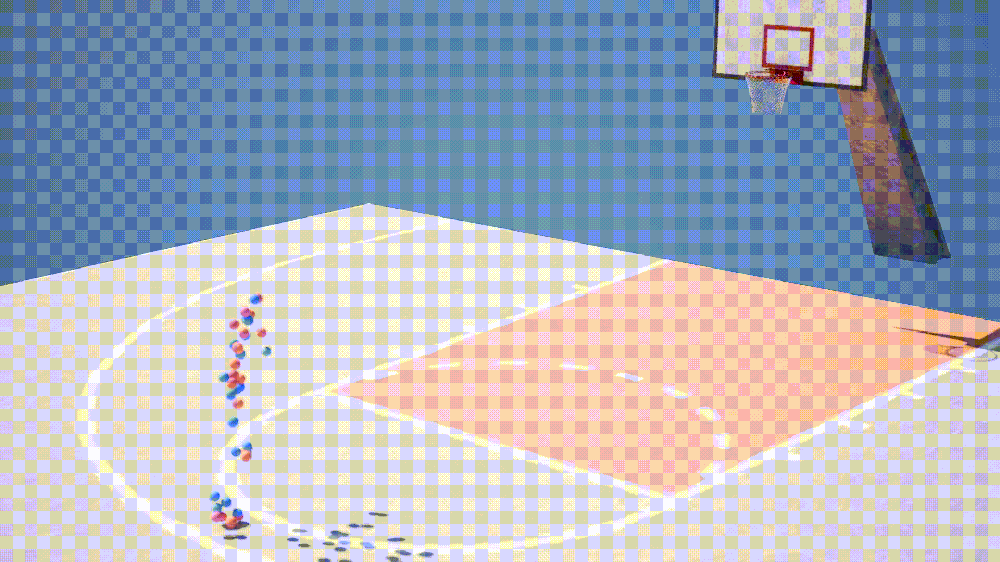

# Multiview 3D Pose Estimation: Manual vs YOLO-Pose Triangulation and MoCap Comparison

# 📑 Index

- [Project Goal](#-project-goal)  
- [Requirements](#️-requirements)  
- [Project Steps](#-project-steps)  
  - [1. Annotate Player’s Poses](#1-annotate-players-poses)  
  - [2. 3D Player Reconstruction via Triangulation](#2-3d-player-reconstruction-via-triangulation)  
  - [3. Alignment with Motion Capture Data](#3-alignment-with-motion-capture-data)  
  - [4. Human Pose Estimation](#4-human-pose-estimation)  
  - [4a. Visualization in Unreal Engine](#4a-visualization-in-unreal-engine)
- [Results](#-results)  
  - [Evaluation Metrics](#evaluation-metrics)  
  - [Triangulation vs MoCap (STEP 3)](#triangulation-vs-mocap-step-3)  
  - [YOLO Pose Triangulation vs MoCap (STEP 4)](#yolo-pose-triangulation-vs-mocap-step-4)  
  - [MoCap vs Triangulation on UE (STEP 4a)](#mocap-vs-triangulation-on-ue-step-4a)
- [Authors](#-authors)


# 🎯 Project Goal

The goal of this project is to **estimate the 3D pose** of a basketball player recorded using a **multi-camera RGB** setup.  
Starting from **manually annotated** 2D keypoints, the player’s 3D skeleton is reconstructed through **geometric triangulation**.  
The estimated poses are then compared with ground-truth **MoCap** data to assess the accuracy of the triangulation.  
Additionally, we test a modern 2D human pose estimation algorithm (**YOLO-Pose**) and evaluate its performance.  
At the end, we display the 3D skeleton on **Unreal Engine**.


# ⚙️ Requirements 
Python version:  
```python 3.12 or later```  
Run this command to install the required libraries:  
```pip install -r requirements.txt```    


# 📋 Project Steps

## 1. Annotate Player’s Poses
- Each action is captured by **four synchronized camera views** (`cam_2`, `cam_5`, `cam_8`, `cam_13`).
- **Only the person wearing the black MoCap suit** was annotated.
- Annotations were created using **Roboflow** and exported in **COCO JSON format**.

  


## 2. 3D Player Reconstruction via Triangulation

Using the 2D keypoints annotated from the multiview cameras, we reconstruct the player’s 3D pose via **triangulation**.

### Pipeline
1. **Rectify input videos and images**  
   The rectification removes lens distortion and aligns all cameras to a common epipolar geometry.  
   *(Important: the same transformation must also be applied to the ground-truth annotations.)*

2. **Triangulation**  
   3D points are computed from corresponding 2D detections across views using the **Direct Linear Transform (DLT)** method.

3. **Visualization**  
   Display the reconstructed 3D skeleton for a given frame.

4. **Reprojection & Evaluation**  
   Reproject the triangulated 3D skeleton back onto each camera view and compare it with the original 2D annotations using standard metrics:
   - **Mean Per Joint Position Error (MPJPE)**
   - **Mean Squared Error (MSE)**

### Script sequence and description
| Script | Description |
|:--|:--|
| `python 02_download_roboflow.py` | Downloads the annotated dataset from **Roboflow** into the working directory. |
| `python 02_rectified_videos.py` | Performs **geometric rectification** on all camera videos using per-camera calibration (mtx, dist).|
| `python 02_rectified_images.py` | Performs **geometric rectification** on all dataset images using per-camera calibration (mtx, dist). |
| `python 02_rectified_annotations.py` | Rectify the 2D keypoint coordinates in the COCO JSON dataset. |
| `python 02_debug_draw_keypoint_over_frame_check.py` | Overlays 2D keypoints on input frames to visually check the annotation alignment. |
| `python 02_triangulation.py` | **Triangulates 3D joint positions** from the 2D keypoints across all camera views. |
| `python 02_plot_3d_skeleton.py` | Displays a **static 3D skeleton plot** for a selected frame, useful for visual debugging. |
| `python 02_generate_reprojected_annotations.py` | Reprojects the 3D skeleton back into each camera view to verify geometric consistency. |
| `python 02_compute_reprojection_error.py` | Computes the **reprojection error** between the original 2D annotations and the reprojected points. |
| `python 02_debug_plot_2D_compare_keypoints.py` | Visualizes and compares 2D keypoints from the original and reprojected annotations for a specific frame. |
| `python 02_animate_triangulation.py` | Creates an animated **3D visualization (GIF)** of the full reconstructed motion sequence. | 

### Executed scripts
   Here is the sequence of commands required to run the project. For convenience, you can simply execute:  
   ```python 99_STEP2_PIPELINE.py```  
   This script will automatically run all the commands in order, one step at a time.  Alternatively, you can manually execute the commands below one by one.  

```bash
python 02_download_roboflow.py
python 02_rectified_videos.py
python 02_rectified_images.py
python 02_rectified_annotations.py
python 02_debug_draw_keypoint_over_frame_check.py --image train/out2_frame_0019_png.rf.aa99af7677dc057dc1f577a91cafef39.jpg --annotations train/_annotations.coco.json --image_id 48 --output temp/02_temp/02_debug_draw_normal.png
python 02_debug_draw_keypoint_over_frame_check.py --image images_rectified/out2_frame_0019_png.rf.aa99af7677dc057dc1f577a91cafef39.jpg --annotations temp/02_temp/02_annotations.coco.rectified.json --image_id 48 --output temp/02_temp/02_debug_draw_rectified.png
python 02_triangulation.py --input temp/02_temp/02_annotations.coco.rectified.json --output temp/02_temp/02_triangulated_3d_skeleton.json
python 02_plot_3d_skeleton.py 1
python 02_generate_reprojected_annotations.py
python 02_compute_reprojection_error.py
python 02_debug_plot_2D_compare_keypoints.py 10
python 02_animate_triangulation.py  --input temp/02_temp/02_triangulated_3d_skeleton.json --out temp/02_temp/02_triangulated_skeleton.gif --fps 12
```

## 3. Alignment with Motion Capture Data

The MoCap system and the multiview RGB setup are **not synchronized**, so alignment must be performed manually or algorithmically.

### Pipeline
1. Identify reference poses (e.g., player raising arms before a shot) in both datasets.
2. Match corresponding poses to align the MoCap and triangulation timelines.
3. Subsample and rename frames to obtain consistent frame rates and naming schemes.
4. Align and compare the 3D skeletons using the **Kabsch–Umeyama algorithm** for alignment.

### Script sequence and description

| Script | Description |
|:--|:--|
| `python 03_cut_frames.py` | Cuts the shot segment of interest from the MoCap sequence. |
| `python 03_adapt_skeleton.py` | Removes unnecessary or unused bones from the skeleton. |
| `python 03_animate_mocap.py` | Generates an **MP4 animation** of the MoCap data (100 fps, 393 frames). |
| `python 03_subsample_mocap.py` | Downsamples the MoCap sequence from **100 fps to 24 fps**. |
| `python 03_rename_frame.py` | Renames frames sequentially (e.g., `frame_980 → frame_1`). |
| `python 03_reorder_triangulation_joints.py` | Reorders the triangulated joints to match the **MoCap joint order**. |
| `python 03_step3compare.py` | Performs a direct comparison between the triangulated and MoCap skeletons and compute some error metrics. |
| `python 03_animate_mocap.py` | Creates an animated **GIF** of the final **3D Triangulated/MoCap skeleton**. |

### Executed scripts
Similar to Step 2, run the full pipeline with:   
```python 99_STEP3_PIPELINE.py```  
You can also execute the following commands manually, one by one.
   
```bash
python 03_cut_frames.py      
python 03_adapt_skeleton.py  
python 03_animate_mocap.py   
python 03_subsample_mocap.py 
python 03_rename_frame.py                   
python 03_reorder_triangulation_joints.py  
python 03_step3compare.py
python 03_animate_mocap.py --input temp/03_temp/03_final_triangulation.json --out temp/03_temp/03_final_triangulation.gif --fps 12 --rotate -90 --name "Triangulated Skeleton"
python 03_animate_mocap.py --input temp/03_temp/03_final_mocap.json --out temp/03_temp/03_final_mocap.gif --fps 12
```

### Frame Alignment

The following table shows the adaptations made to make the MoCap and Triangulation data compatible.

| MoCap Frame | Triangulation Frame | Notes              |
|-------------|---------------------|--------------------|
| 1322        | 42                  | baseline alignment |
| 1372        | 48                  | 8.3 fps × 6 frames |
| 980         | 1                   | 8.3 fps × 41 frames|

### Motion Capture Keypoints
```bash
'Hips', 'Spine', 'Spine1', 'Spine2', 'Neck', 'Head',
'LeftShoulder', 'LeftArm', 'LeftForeArm', 'LeftForeArmRoll', 'LeftHand',
'RightShoulder', 'RightArm', 'RightForeArm', 'RightForeArmRoll', 'RightHand',
'LeftUpLeg', 'LeftLeg', 'LeftFoot', 'LeftToeBase',
'RightUpLeg', 'RightLeg', 'RightFoot', 'RightToeBase'
```

Removed six extra joints:  
`Spine`, `Spine2`, `LeftShoulder`, `LeftForeArmRoll`, `RightShoulder`, `RightForeArmRoll`.

### Triangulation Keypoints
```bash
"Hips", "RHip", "RKnee", "RAnkle", "RFoot",
"LHip", "LKnee", "LAnkle", "LFoot",
"Spine", "Neck", "Head",
"RShoulder", "RElbow", "RHand",
"LShoulder", "LElbow", "LHand"
```

### Unified Skeleton Order (used for comparison)
```bash
'Hips', 'Spine', 'Neck', 'Head',
'LShoulder', 'LElbow', 'LHand',
'RShoulder', 'RElbow', 'RHand',
'LHip', 'LKnee', 'LAnkle', 'LFoot',
'RHip', 'RKnee', 'RAnkle', 'RFoot'
```


## 4. Human Pose Estimation

For the human pose estimation step, we used the pre-trained **YOLO v11 pose model**.

### Pipeline
1. Run YOLO Pose Algorithm on each camera view
2. Evaluate the 2D estimated pose from YOLO with 2D ground truth annotations
3. Triangulate the yolo pose from each camera view to estimate the 3D player pose (same code of step 2)
4. Evaluate the 3D estimated pose with common HPE metric wrt motion capture data

### Script sequence and description 

| Script | Description |
|:--|:--|
| `python 04_divide_images.py` | Splits all rectified images into subfolders based on their camera ID (`cam_2`, `cam_5`, `cam_8`, `cam_13`). |
| `python 04_yolo_pose.py` | Runs **YOLO-Pose inference** on each camera’s images to detect human keypoints and export them as JSON files. |
| `python 04_test_labels.py` | Visualizes detected keypoints on sample images to verify YOLO-Pose results for each camera. |
| `python 04_remove_multiple_people.py` | Filters frames containing multiple detections, keeping only the player of interest across all cameras. |
| `python 04_adapt_keypoint.py` | For each camera (2,5,8,13), removes incompatible or irrelevant joints from the YOLO output to match the MoCap joint set. |
| `python 04_merge_pose_jsons_like_rectified.py` | Merges all filtered YOLO JSONs (`cam_2`, `cam_5`, `cam_8`, `cam_13`) into a single COCO-style annotation file. |
| `python 02_triangulation.py` | Triangulates 3D joint positions from the YOLO-Pose 2D detections (using the same script of step 2). |
| `python 04_animate_yolo.py` | Creates a **3D animated GIF** of the reconstructed skeleton from YOLO detections. |
| `python 04_adapt_mocap.py` | Removes extra joints from the MoCap data to make it compatible with the YOLO skeleton. |
| `python 03_step3compare.py` | Compares the **triangulated YOLO skeleton** with the **adapted MoCap skeleton**, aligning them via similarity transformation. |

### Executed scripts
Similar to Step 2, run the full pipeline with:   
```python 99_STEP4_PIPELINE.py```  
You can also execute the following commands manually, one by one.

```bash
python 04_divide_images.py

python 04_yolo_pose.py --images images_rectified/cam_2 --output temp/04_temp/labels2.json --weights yolo11l-pose.pt --imgsz 3840 --conf 0.20 --device cuda:0
python 04_yolo_pose.py --images images_rectified/cam_5 --output temp/04_temp/labels5.json --weights yolo11l-pose.pt --imgsz 3840 --conf 0.20 --device cuda:0
python 04_yolo_pose.py --images images_rectified/cam_8 --output temp/04_temp/labels8.json --weights yolo11l-pose.pt --imgsz 3840 --conf 0.20 --device cuda:0
python 04_yolo_pose.py --images images_rectified/cam_13 --output temp/04_temp/labels13.json --weights yolo11l-pose.pt --imgsz 3840 --conf 0.20 --device cuda:0

python 04_test_labels.py --images images_rectified/cam_2 --json temp/04_temp/labels2.json --outdir temp/04_temp/cam2
python 04_test_labels.py --images images_rectified/cam_5 --json temp/04_temp/labels5.json --outdir temp/04_temp/cam5
python 04_test_labels.py --images images_rectified/cam_8 --json temp/04_temp/labels8.json --outdir temp/04_temp/cam8
python 04_test_labels.py --images images_rectified/cam_13 --json temp/04_temp/labels13.json --outdir temp/04_temp/cam13


# N.B. Before this comands, go to temp/04_temp and, for each camera (cam2, cam5, cam8, cam13), check the player's id (black tracksuit): if different, correct it below.
python 04_remove_multiple_people.py --input temp/04_temp/labels2.json --output temp/04_temp/labels2_filtered.json --keep_id 1
python 04_remove_multiple_people.py --input temp/04_temp/labels5.json --output temp/04_temp/labels5_filtered.json --keep_id 2
python 04_remove_multiple_people.py --input temp/04_temp/labels8.json --output temp/04_temp/labels8_filtered.json --keep_id 1
python 04_remove_multiple_people.py --input temp/04_temp/labels13.json --output temp/04_temp/labels13_filtered.json --keep_id 1

python 04_adapt_keypoint.py 2
python 04_adapt_keypoint.py 5
python 04_adapt_keypoint.py 8
python 04_adapt_keypoint.py 13

python 04_merge_pose_jsons_like_rectified.py temp/04_temp/labels2_filtered_adapted.json temp/04_temp/labels5_filtered_adapted.json temp/04_temp/labels8_filtered_adapted.json temp/04_temp/labels13_filtered_adapted.json --out temp/04_temp/annotations_yolo.json

python 02_triangulation.py --input temp/04_temp/annotations_yolo.json --output temp/04_temp/04_triangulated_yolo.json
python 04_animate_yolo.py --input temp/04_temp/04_triangulated_yolo.json --out temp/04_temp/04_yolo.gif --fps 12
python 04_adapt_mocap.py   
python 03_step3compare.py --mocap temp/04_temp/04_adapted_final_mocap.json --triang temp/04_temp/04_triangulated_yolo.json --align similarity
```

## 4a. Visualization in Unreal Engine

To visualize the reconstructed motion in **Unreal Engine**, follow these steps:

1. **Export the animations from Blender:**
   - Open an empty Blender project.
   - Run the script `04_blender_create_fbx.py` **twice**:
     - Once using the **MoCap data JSON**.
     - Once using the **Triangulation JSON**.
   - Each execution will generate an **FBX file** containing the corresponding 3D animation.

2. **Import into Unreal Engine:**
   - Create a **new blank project** in Unreal Engine.
   - Import the two **FBX files** (MoCap and Triangulation) into the project.
   - Add both animations to the **Level Sequence** or directly to the scene.

3. **Play the animation:**
   - Press **Play** to visualize and compare the MoCap and triangulated 3D skeletons directly in Unreal Engine.  


<br>

# 📊 Results

## Evaluation Metrics
- Mean Per Joint Position Error (MPJPE)
- Mean Squared Error (MSE)
- Median Joint Error

## Triangulation vs MoCap (STEP 3):

MPJPE 69.7 mm (mean), 69.8 mm (median)<br>
MSE 5767.8 mm², RMSE 75.3 mm<br>
Coherent 3D reconstruction with ~7–8 cm average joint error.

<p align="center">
  
  
</p>

## YOLO Pose Triangulation vs MoCap (STEP 4):

MPJPE 68.9 mm (mean), 66.1 mm (median)<br>
MSE 5947.1 mm², RMSE 75.3 mm<br>
Coherent 3D reconstruction with ~7–8 cm average joint error.

<p align="center">
  
  
</p>

## MoCap vs Triangulation on UE (STEP 4a):
<p align="center">
  
</p>

# 👥 Authors

Nicola Cappellaro - nicola.cappellaro@studenti.unitn.it  
Riccardo Zannoni  - riccardo.zannoni@studenti.unitn.it
